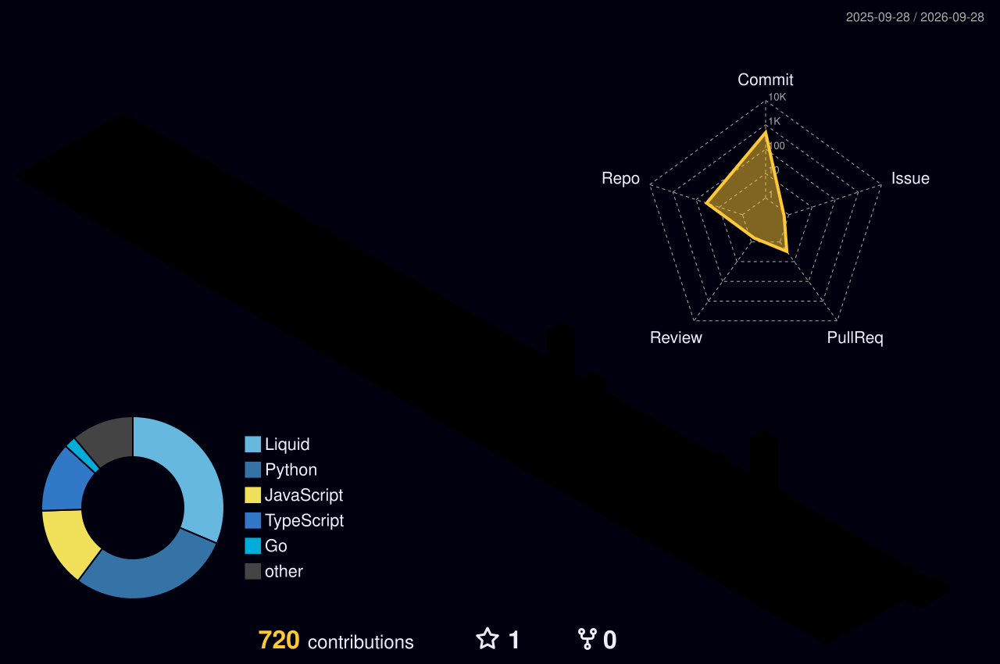

  <h1>Hi, I'm Tajinder Singh Dhillon 👋</h1>
  

    <strong>Final-year B.Tech CSE student • Full-stack & AI builder • Exploring Blockchain/Web3</strong>
  

  

    
    
    
    
  

---

## 👨‍💻 About Me

Final-year **B.Tech Computer Science** student passionate about building scalable full-stack and AI-powered applications.

- 💡 I enjoy turning real-world problems into practical software solutions, especially in civic tech, automation, and intelligent systems.
- ⛓️ Currently focused on expanding into **blockchain development** and Web3 ecosystems while building AI-driven products.
- ⚡ Constantly shipping, experimenting with modern architectures, and optimizing user experiences.

---

## 🔭 What I’m Working On

- 🤖 **AI Applications:** Building AI-powered applications tailored for practical, real-world use cases.
- 📊 **Complaint Analyzer AI:** Developing an intelligent triage and complaint analyzer system for institutions.
- 🏛️ **Civic-Tech Platform:** Working on a civic-tech initiative inspired by *"My Nagpur"* to simplify civic engagement.
- 🌐 **Blockchain / Web3:** Exploring decentralized protocols, smart contracts, and Web3 ecosystems.

---

## 🛠️ Tech Stack

**Languages**  

**Frontend**  

**Backend & Real-Time**  

**Databases & ORM**  

**Tools & Workflow**  

---

## 📌 Featured Projects

| Project | Description | Tech Stack | Links |
| :--- | :--- | :--- | :---: |
| **[RTC — Real-Time Chat](https://github.com/tajinder2317/RTC)** | Production-grade messaging platform featuring user discovery, friend requests, real-time messaging, and delivery/read receipts. | React, Node.js, Express, Socket.IO, Prisma, PostgreSQL |  |
| **[College Project](https://github.com/tajinder2317/collegeProject)** | Engineering academic repository covering coursework architectures, core modules, and experiments. | Python, C++, Full-Stack |  |
| **Complaint Analyzer AI** | Intelligent system for automated organizational complaint classification, sentiment detection, and resolution workflows. | Python, AI/ML, REST APIs | *In Progress* |
| **Civic-Tech Platform** | Civic monitoring and engagement tool inspired by municipal solutions for Nagpur. | React, Node.js, Express | *In Progress* |

  

---

## 📈 GitHub Analytics & Activity

  
  

  

### 🐍 Contribution Snake

  <picture>
    <source
      media="(prefers-color-scheme: dark)"
      srcset="https://raw.githubusercontent.com/tajinder2317/tajinder2317/main/assets/github-contribution-grid-snake-dark.svg"
    />
    
  </picture>

### 🧊 3D Contribution Heatmap

  

---

## ⚡ Strengths
- 🎯 **Product-Oriented Mindset:** Strong focus on building practical, real-world solutions rather than just simple demo apps.
- 🤖 **Full-Stack + AI Expertise:** Skilled in connecting robust backend infrastructure with AI capabilities and responsive frontends.
- 🧠 **Fast Learner & Adaptive:** Quick to pick up emerging technologies, architectures, and low-level tools (Rust, Web3).
- ⛓️ **Forward-Looking:** Passionate about exploring the intersection of decentralized Web3 systems and intelligent agents.

---

## 🎯 Career Goals
- 💼 Aiming to work as a **Full-Stack / Blockchain Developer**.
- 🚀 Looking for opportunities to build impactful, high-scale tech products.
- 🌍 Open to **full-time engineering roles**, **freelance contracts**, and **global opportunities**.

---

## 📬 Let's Connect

I'm always excited to connect with fellow builders, founders, and recruiters. Feel free to reach out!

  
  
  
  

---

  💡 <em>"I enjoy building things that actually solve real problems instead of just demo projects."</em>

